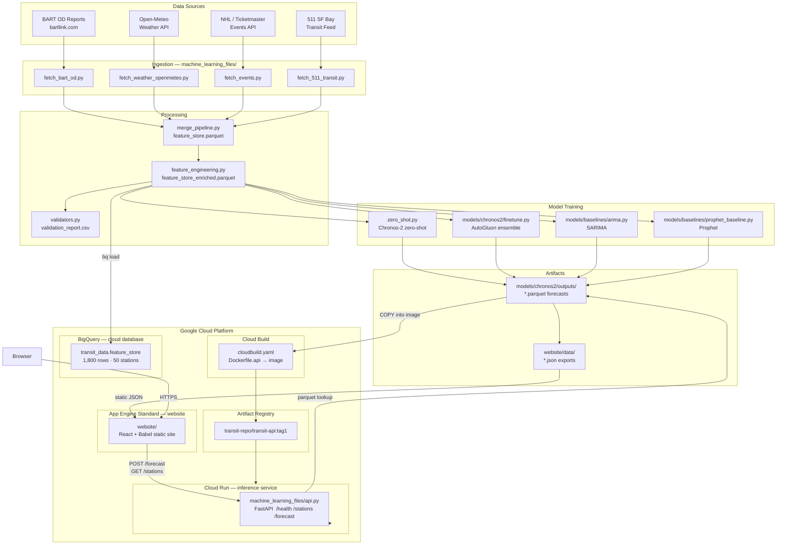

# Architecture

## System Diagram



## Component Responsibilities

| Component | Location | Responsibility |
| --- | --- | --- |
| Source configuration | `configs/sources.yaml` | API endpoints, station coordinates, venue IDs, key placeholders |
| Model configuration | `configs/model.yaml` | Granularity, split dates, context length, horizon, quantiles |
| Ingestion | `machine_learning_files/fetch_*.py` | Download source data into `data/raw/` |
| Feature store | `machine_learning_files/merge_pipeline.py` | Build `data/processed/feature_store.parquet` and chronological splits |
| Feature engineering | `Processing/feature_engineering.py` | Add calendar, weather, event, lag, rolling, station covariates |
| Validation | `evaluation/validators.py` | Schema checks, missing windows, coverage, anomaly detection |
| Forecasting | `machine_learning_files/zero_shot.py`, `models/chronos2/`, `models/baselines/` | Produce forecast parquet files |
| Website export | `scripts/export_website_data.py` | Convert model artifacts into `website/data/*.json` |
| API service | `machine_learning_files/api.py` | FastAPI: cached parquet lookup → live Chronos inference fallback |
| Website | `website/` | React/Babel static frontend deployed on App Engine Standard |
| Docker (pipeline) | `Dockerfile` | Reproducible full pipeline container |
| Docker (serving) | `Dockerfile.api` | Lightweight API image baked with pre-computed forecasts |
| Cloud build | `cloudbuild.yaml` | Build `Dockerfile.api` for `linux/amd64`, push to Artifact Registry |

## Data Flow

```
BART OD reports ──► fetch_bart_od.py ──► data/raw/transit/bart/
Open-Meteo API  ──► fetch_weather.py ──► data/raw/weather/
Events APIs     ──► fetch_events.py  ──► data/raw/events/
                           │
                           ▼
                  merge_pipeline.py
                           │
                  feature_store.parquet (station × month × covariates)
                           │
                  feature_engineering.py
                           │
                  feature_store_enriched.parquet ──► BigQuery
                           │
              ┌────────────┼────────────┐
              ▼            ▼            ▼
         zero_shot     finetune.py   arima.py / prophet.py
              │            │            │
              └────────────┴────────────┘
                           │
                  models/*/outputs/*.parquet
                           │
                  ┌────────┴────────┐
                  ▼                 ▼
         Dockerfile.api      export_website_data.py
                  │                 │
          Cloud Run API      website/data/*.json
                  │                 │
                  └────────┬────────┘
                           ▼
                    App Engine Website
                           │
                        Browser
```

## Artifact Contracts

### Feature Store Schema (minimum required columns)

| Column | Type | Meaning |
| --- | --- | --- |
| `timestamp` | datetime | Month start (`MS` cadence) |
| `station_id` | string | BART OD origin station code |
| `station_name` | string | Human-readable station name |
| `ridership` | int | Monthly boardings (target variable) |
| `agency_id` | string | `BA` for BART |
| `transit_mode` | string | `rail` |

### API Endpoints

| Method | Path | Input | Output |
| --- | --- | --- | --- |
| GET | `/health` | — | `{status, model_loaded, store_loaded}` |
| GET | `/stations` | — | `[{station_id, station_name}]` |
| POST | `/forecast` | `{station_id, horizon_hours}` | `{station_id, forecasts: [{timestamp, p10, p50, p90}]}` |

### Chronological Splits

| Split | Period |
| --- | --- |
| Train | Jan 2021 – Dec 2022 |
| Validation | Jan 2023 – Jun 2023 |
| Test | Jul 2023 onward |

## Scalability

| Service | Scaling behaviour |
| --- | --- |
| App Engine Standard | Auto-scales instances; scales to zero when idle |
| Cloud Run | Scales 0→N replicas per request concurrency; stateless |
| BigQuery | Serverless; scales automatically for analytical queries |
| Pre-computed cache | Parquet lookup in Cloud Run — sub-100 ms, no model load |
| Live inference fallback | Chronos-T5-Small on CPU; upgrade path: GPU Cloud Run or Vertex AI |
